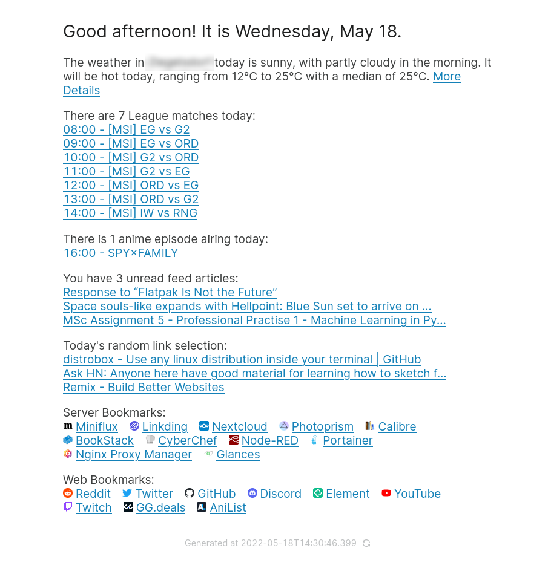

> WARNING: This project is intended for my personal use with very limited error handling and testing. Use at your own risk.

# startpage



This is a simple website designed to be my personal browser homepage.

It features several API integrations:
- [x] Weather from [wttr.in](https://wttr.in/)
- [x] Unread feed items from [Miniflux](https://miniflux.app/) (self-hosted)
- [x] Random selection of links from [Linkding](https://github.com/sissbruecker/linkding) (self-hosted)
- [x] Upcoming matches on [lolesports.com](https://lolesports.com/)
- [x] Airing anime, based on an [AniList](https://anilist.co/) profile's watching/planning list
- [x] Two sections of quick access bookmarks defined in the project config file

Planned future integrations:
- [ ] Upcoming calendar events from Nextcloud or any webdav calendar
- [ ] Japanese Learning stats from WaniKani, KameSame and Anki

The site is designed to be rebuilt once per day in the morning, displaying the integrations' information relevant to that day.
There is no live data fetching, this is by design to avoid getting distracted by new content appearing throughout the day. It also makes the site extremely fast and lightweight, making it suitable for use as a new tab page.

## Installation

### Docker

The site is best hosted via docker/docker-compose, simply clone the repo and run `docker-compose up`. The docker-compose file includes a [filebrowser](https://filebrowser.org/) instance which can be used to easily edit the project config. The project requires several environment variables to be set in order for the integrations to work, refer to the `.env.example` file to learn about them.

The site will be hosted on port `8120` by default, with the filebrowser at `8121`. These ports can be changed in the docker-compose file.

### Firefox new tab page

Setting the website as the new tab page in Firefox requires this addon: [Custom New Tab Page](https://github.com/methodgrab/firefox-custom-new-tab-page). Open the addon's options and set the New Tab URL to the website's URL. The site is built to work with this addon out of the box, so no further configuration is required.

## Development

```sh
git clone https://github.com/jgierer12/startpage.git
cd startpage

cp .env.example .env
cp config.example.json config.json
# configure environment variables and options in the above files

npm install
npm run dev
```
